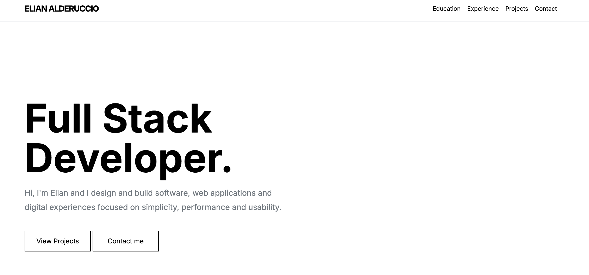

# 👨‍💻 Personal Portfolio

Minimalist single-page developer portfolio built with HTML, Bootstrap and JavaScript.

  

## ✨ Features

- Responsive single-page design
- Minimal black & white aesthetic
- Smooth scrolling navigation
- Scroll reveal animations
- Education & Experience timeline
- Project showcase section
- Contact section with social links
- Optimized for desktop and mobile

## 📂 Sections

- Home
- About Me
- Education
- Experience
- Projects
- Get In Touch

# 📱 NFC Business Card

Included in this repository is a dedicated NFC-powered digital business card located in the `card-nfc` directory.

  

By tapping or scanning an NFC tag, users are instantly redirected to a mobile-optimized page containing:

- Professional contact information
- One-tap contact saving (vCard support for iOS and Android)
- Social media profiles
- GitHub repositories
- Personal portfolio website

The digital card allows visitors to instantly save contact details directly to their smartphone, eliminating the need for manual data entry.

Designed with a mobile-first approach, it provides a fast, seamless, and paperless way to share professional information through NFC technology.